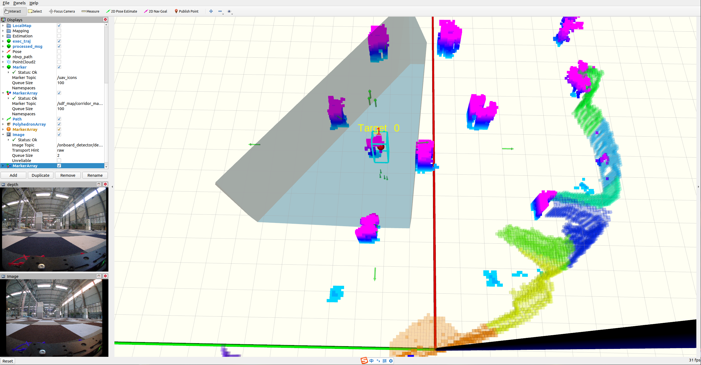

# Fast-Exploration 快速探索使用说明

## 效果示例





1. 启动探索管理器：

   ```
   roslaunch exploration_manager exploration.launch
   ```

2. 启动走廊生成器：

   ```
   roslaunch corridor_generator corridor_generator.launch
   ```

3. 启动机载目标检测器：

   ```
   roslaunch onboard_detector run_detector.launch
   ```

4. 下载测试用的数据包（rosbag）进行回放：

   [下载数据包](https://drive.google.com/file/d/1H60r3rvfqoiRxaIfu8fYR7LlLVLon7CA/view?usp=sharing)